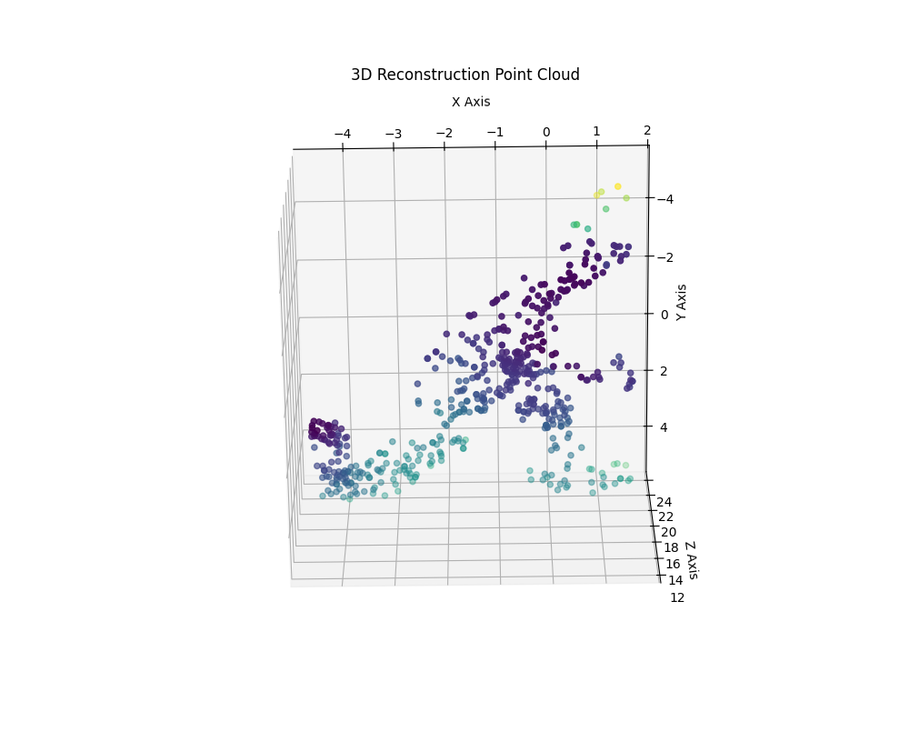

# 3D Object Reconstruction from 2D Images

This project implements a classic computer vision pipeline to reconstruct a 3D point cloud of an object from a sequence of 2D images. Using Python and OpenCV, it demonstrates the core principles of Structure from Motion (SfM) by calculating camera geometry and triangulating 3D points from pixel correspondences.

<div align="center">
  
  <br />
  <em>Fig 1. The final 3D point cloud reconstructed from the Dinosaur dataset.</em>
</div>

**Note:** You will need to take a screenshot of your final 3D plot, name it `3d_point_cloud.png`, and add it to your repository for the image above to display correctly.

## Technical Pipeline

The 3D reconstruction is achieved through a multi-step process:

1.  **Feature Detection & Matching:**
    * The **SIFT (Scale-Invariant Feature Transform)** algorithm is used to detect unique, stable keypoints in two consecutive images.
    * A numerical **descriptor** is computed for each keypoint, representing its local visual characteristics.
    * A **Brute-Force Matcher** compares descriptors between the two images to find initial point correspondences. Lowe's ratio test is applied to filter out ambiguous matches.

2.  **Robust Camera Pose Estimation:**
    * The **Essential Matrix**, which encodes the relative rotation and translation between the two camera views, is calculated from the matched keypoints.
    * The **RANSAC (Random Sample Consensus)** algorithm is used within this step to ensure the Essential Matrix is robust and not skewed by outlier (incorrect) matches.
    * The camera's final **Rotation (R)** and **Translation (t)** matrices are recovered from the Essential Matrix.

3.  **Triangulation:**
    * With the known 2D positions of the matched points and the calculated camera motion (`R` and `t`), the `cv2.triangulatePoints` function is used to compute the 3D coordinates of each point.
    * This process calculates where the lines of sight from each camera intersect in 3D space, effectively creating the point cloud.

## Technologies Used
* Python
* OpenCV (`opencv-contrib-python`)
* NumPy
* Matplotlib

## How to Run

1.  **Clone the Repository:**
    ```bash
    git clone [https://github.com/YourUsername/3D-Reconstruction-Project.git](https://github.com/YourUsername/3D-Reconstruction-Project.git)
    cd 3D-Reconstruction-Project
    ```

2.  **Set up the Environment:**
    ```bash
    # Create a conda environment
    conda create --name cv-project python=3.9
    conda activate cv-project

    # Install dependencies
    pip install -r requirements.txt
    ```

3.  **Run the Script:**
    Make sure the image files (e.g., from the Dinosaur dataset) are present in the `images` subfolder. Then, run the main script from the terminal:
    ```bash
    python main.py
    ```
